<div align="center">


# clef-compactor

### Keep the evidence. Cut the noise.

**Query-aware RAG context compaction with [Cloudflare Clef](https://blog.cloudflare.com/clef-decision-models/).**<br />
Score an entire retrieval batch against the query, retain the chunks that earn their place, and send a smaller, auditable context to your LLM.

[](https://github.com/Gjusev/clef-compactor/actions/workflows/test.yml)
[](https://pypi.org/project/clef-compactor/)
[](https://www.python.org/)
[](https://developers.cloudflare.com/workers-ai/models/clef/)
[](LICENSE)

[Get started](#quick-start) · [Watch the demo](#demo) · [How it works](#how-it-works) · [Benchmarks](#benchmarks) · [Kaggle notebook](https://www.kaggle.com/code/gjusev/clef-compactor-evals)

</div>

<br />

<div align="center">
  
</div>

<br />

<div align="center">
  <a href="docs/brag.mp4">
    
  </a>
  <br />
  <sub><strong>▶ 12-second product demo</strong> · <a href="docs/brag.mp4">Open video</a> · <a href="docs/index.html">View landing page</a></sub>
</div>

## Why clef-compactor?

Retrieval can be noisy. If a retriever returns 12 chunks, your LLM normally reads—and you pay for—all 12, even when several are off-topic. clef-compactor asks Clef whether each chunk is needed for the user's query, ranks the answers, then fills your token budget with the strongest evidence.

| What it does | Why it matters |
| --- | --- |
| **Keeps text verbatim** | Citations and provenance remain intact—nothing is summarized or rewritten. |
| **Explains every cut** | Dropped chunks are marked `irrelevant` or `budget_exhausted`. |
| **Batches requests** | One Cloudflare call scores up to 64 chunks. |
| **Fits your stack** | Sync and async clients, CLI, OpenAI-compatible handler, LangChain, and LlamaIndex adapters. |

<a id="demo"></a>

## Demo

The video above is embedded as a clickable preview for GitHub compatibility. You can also play it directly here:

<video src="docs/brag.mp4" poster="docs/brag.jpg" controls muted loop playsinline width="100%">
  Your browser does not support embedded video. <a href="docs/brag.mp4">Open the 12-second demo</a>.
</video>

It shows five retrieved chunks flowing through the relevance gate: useful passages are retained, unrelated context is removed with a reason, and the final context is 34% smaller.

## Quick start

```bash
pip install clef-compactor

# PowerShell
$env:CLEF_ACCOUNT_ID = "your_account_id"
$env:CLEF_API_TOKEN = "your_api_token"

# bash / zsh
export CLEF_ACCOUNT_ID=your_account_id
export CLEF_API_TOKEN=your_api_token
```

```python
from clef_compactor import ClefCompactor

compactor = ClefCompactor()
result = compactor.compact(
    "What is the refund policy?",
    retrieved_chunks,
    token_budget=1_000,
)

context = "\n\n".join(result.kept_texts())  # exact original chunk text
print(result.saved_fraction)                   # e.g. 0.71 = 71% fewer tokens
print(result.dropped[0].drop_reason)           # irrelevant | budget_exhausted
```

> Need a runnable, credential-free tour? Open [the example notebook](examples/demo.ipynb), which uses a canned API response.

### Async

```python
from clef_compactor import AsyncClefCompactor

compactor = AsyncClefCompactor(model="clef-flash")
result = await compactor.compact(query, chunks, token_budget=800)
await compactor.aclose()
```

### CLI

```bash
clef-compact -q "refund policy" -d "chunk one" "chunk two" --budget 1000
clef-compact -q "..." -d @chunk1.txt @chunk2.txt --json --model clef-flash
```

## How it works

<div align="center">
  
</div>

1. **Build a decision for each chunk.** The query and a configurable preview of every retrieved chunk are sent as Clef `noul` questions.
2. **Score the batch.** Clef returns `P(relevant)` for each chunk; batches larger than 64 are split automatically.
3. **Rank and fit the budget.** Chunks are sorted by relevance score, then token count and original position; the best ones are greedily retained until the budget is full.
4. **Keep an audit trail.** The result contains kept and dropped chunks, scores, token counts, API usage, latency, and a cost estimate.

## Integrations

| OpenAI-compatible | LangChain | LlamaIndex |
| --- | --- | --- |
| Wrap a FastAPI endpoint and return an OpenAI response. | Use a document compressor in your retrieval pipeline. | Add a node postprocessor to an existing query engine. |

<details>
<summary><strong>OpenAI-compatible endpoint</strong></summary>

```python
from fastapi import FastAPI
from clef_compactor import ClefCompactor
from clef_compactor.compat.openai import handle_chat_completions

app = FastAPI()
compactor = ClefCompactor()

@app.post("/v1/chat/completions")
async def chat_completions(payload: dict):
    return handle_chat_completions(payload, compactor=compactor)
```

Put chunks in `clef.chunks`, or supply context as non-user messages. The compacted context is returned in `choices[0].message.content`; before/after token counts are in `usage`.
</details>

<details>
<summary><strong>LangChain</strong></summary>

```bash
pip install "clef-compactor[langchain]"
```

```python
from clef_compactor.integrations.langchain import ClefDocumentCompressor

compressor = ClefDocumentCompressor(token_budget=800)
compressed = compressor.compress_documents(docs, query="refund policy?")
```
</details>

<details>
<summary><strong>LlamaIndex</strong></summary>

```bash
pip install "clef-compactor[llamaindex]"
```

```python
from clef_compactor.integrations.llamaindex import ClefNodePostprocessor

query_engine = RetrieverQueryEngine(
    retriever=base_retriever,
    node_postprocessors=[ClefNodePostprocessor(token_budget=800)],
)
```
</details>

## Benchmarks

### Local, open-weights evaluation

`clef-flash` 9B in float16 on **2× Kaggle T4 GPUs**, evaluated over 20 labelled cases (104 chunks). The evaluation data and result are committed in this repository; the GPU run is available in the [Kaggle notebook ↗](https://www.kaggle.com/code/gjusev/clef-compactor-evals).

| Metric | Result |
| --- | ---: |
| Chunk accuracy | 0.712 |
| Kept precision | 0.771 |
| Relevant recall | 0.746 |
| Kept F1 | 0.758 |
| Context tokens saved | **38.4%** |
| Scoring latency (p50 / p95) | 1,274 / 1,407 ms |
| Cost per 1k calls | $0.00 (self-hosted weights) |

Run the deterministic pipeline validation locally:

```bash
python evals/run_eval.py
```

The replay scorer validates the ranking and budget machinery—not model quality—and scores 0.990 chunk accuracy, 0.992 kept F1, and 34.0% saved tokens. For a live hosted-API run, configure credentials and use `python evals/run_eval.py --mode live`.

### Clef and Laya: the decision-quality trade-off

Published figures from Cloudflare's [Introducing Clef](https://blog.cloudflare.com/clef-decision-models/) post:

| Benchmark | Clef | Clef Flash | Laya |
| --- | ---: | ---: | ---: |
| BFCL, case exact | 98.47 | **98.76** | 38.13 |
| ToolRet, nDCG@10 | **69.19** | 66.43 | 12.69 |
| API-Bank accuracy | 91.93 | **93.11** | 11.41 |
| Median latency | 209.3 ms | 38.8 ms | **5.8 ms** |
| Context window | 65,536 | 65,536 | 32k (reported) |

In short: Laya is the lower-latency local option; Clef gives substantially stronger decision quality; Clef Flash is the pragmatic middle ground. clef-compactor adds one network round trip per 64 chunks.

## Configuration

| Variable | Default | Purpose |
| --- | --- | --- |
| `CLEF_ACCOUNT_ID` / `CLOUDFLARE_ACCOUNT_ID` | required | Cloudflare account ID |
| `CLEF_API_TOKEN` / `CLOUDFLARE_API_TOKEN` | required | Token with Workers AI run permission |
| `CLEF_MODEL` | `clef` | `clef` or `clef-flash` |
| `CLEF_BASE_URL` | Cloudflare v4 API | Override for AI Gateway or tests |
| `CLEF_TIMEOUT` | `60` | Per-request timeout in seconds |
| `CLEF_MAX_RETRIES` | `2` | Retries for 408 / 429 / 5xx and network failures |
| `CLEF_LOG_LEVEL` | `WARNING` | Standard-library logger level |

Errors derive from `ClefError`, so a single `except` covers authentication, rate limits (including `retry_after`), server failures, timeouts, network errors, and malformed responses. Retries use exponential backoff with jitter and honour `Retry-After`.

## Limitations

- **Evaluation scope.** The local result is from a 9B model on two T4 GPUs—not Cloudflare's hosted endpoint or the larger 27B model. Run `--mode live` before quoting hosted-model quality.
- **Latency.** Model decision latency is 209 ms for Clef and 38.8 ms for Clef Flash, plus network time. If every millisecond matters, see [laya-compactor](https://github.com/Gjusev/laya-compactor).
- **Estimated token counts.** Budgets use `cl100k_base` as a close proxy rather than Cloudflare's exact tokenizer.
- **Preview scoring.** Only the first 512 characters of each chunk are scored by default. Increase `chunk_preview_chars` if important context is deep in a chunk.
- **Binary relevance.** Clef emits `P(relevant)`, not a graded “supporting vs. essential” signal.

## Project links

<div align="center">

[PyPI](https://pypi.org/project/clef-compactor/) · [Source](https://github.com/Gjusev/clef-compactor) · [Issues](https://github.com/Gjusev/clef-compactor/issues) · [Releases](https://github.com/Gjusev/clef-compactor/releases) · [Kaggle notebook](https://www.kaggle.com/code/gjusev/clef-compactor-evals) · [Cloudflare Clef](https://huggingface.co/Cloudflare/clef)

</div>

## License

Apache-2.0. Clef itself is open source on [Hugging Face](https://huggingface.co/Cloudflare/clef) under the same license.
