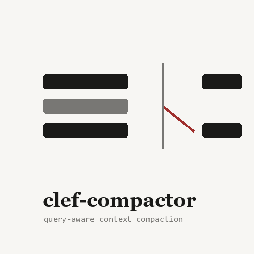
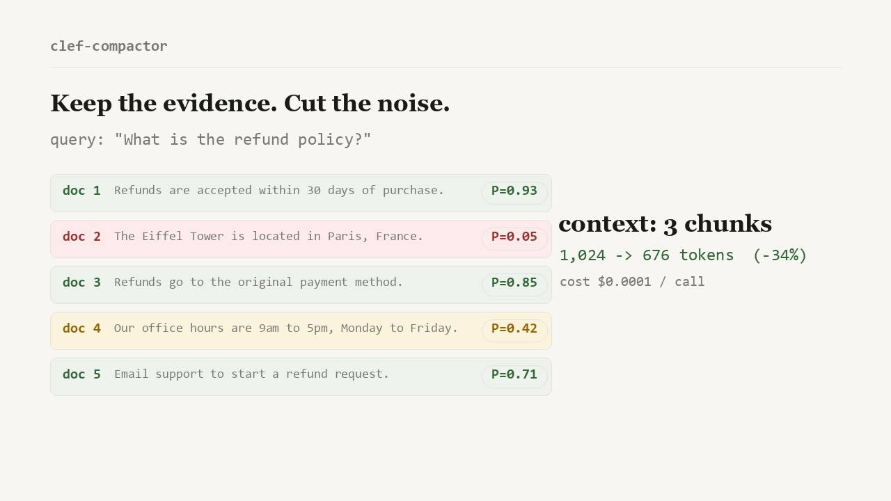

<div align="center">



# clef-compactor

**Keep the evidence. Cut the noise.**

Query-aware RAG context compaction using [Cloudflare's Clef](https://blog.cloudflare.com/clef-decision-models/).
Score a whole retrieval batch against the query in one API call, keep the chunks worth sending to your LLM.

[](https://github.com/Gjusev/clef-compactor/actions/workflows/test.yml)
[](https://pypi.org/project/clef-compactor/)
[](https://www.python.org/)
[](LICENSE)
[](src/clef_compactor/py.typed)

[Quick start](#quick-start) · [How it works](#how-it-works) · [Measured results](#measured-results) · [clef vs laya](#clef-vs-laya) · [Limitations](#limitations)

</div>

<a href="docs/brag.mp4">
  
</a>

<p align="center">
  <a href="docs/brag.mp4"><strong>▶ Watch the 12-second demo</strong></a>
  · <a href="docs/index.html">landing page</a>
  · <a href="docs/how-it-works.svg">animated diagram</a>
</p>

Your retriever returns 12 chunks. Your LLM reads all of them and you pay for all of them, including the ones about the Eiffel Tower when the user asked about refunds. clef-compactor asks Clef one question per chunk ("is this needed to answer the query?"), then fills a token budget with the best answers.

Chunks are kept verbatim or removed with a recorded reason. The library never rewrites text, so citations stay auditable.

## How it works

```
                       clef-compactor
                       ───────────────
 query ──────────────► │             │
                       │  build      │
 chunks ─────────────► │  1 noul     │        ┌─────────────────────────┐
 [c1][c2]...[cN]       │  question   │──────► │  Cloudflare Clef API    │
                       │  per chunk  │        │  P(relevant) per chunk  │
                       │  (≤64/req)  │◄───────┴─────────────────────────┘
                       │             │
                       │  rank:      │
                       │  score desc │        c1 P=0.93  ──► keep
                       │  tokens asc │        c3 P=0.85  ──► keep
                       │  index asc  │        c5 P=0.42  ──► cut (budget)
                       │             │        c2 P=0.05  ──► cut (irrelevant)
                       │  fill       │
                       │  budget     │──────► CompactResult
                       └─────────────┘        kept / dropped / scores
                                              tokens, usage, cost estimate
```

One API call per 64 chunks. Dropped chunks carry a reason: `irrelevant` (below the threshold) or `budget_exhausted` (did not fit). Both are dataclasses, so you can log them or show them to a user.

## Quick start

```bash
pip install clef-compactor
export CLEF_ACCOUNT_ID=your_account_id
export CLEF_API_TOKEN=your_api_token
```

```python
from clef_compactor import ClefCompactor

compactor = ClefCompactor()
result = compactor.compact(
    "What is the refund policy?",
    retrieved_chunks,
    token_budget=1000,
)

result.kept_texts()          # surviving chunks, ranked best first, text unchanged
result.dropped[0].drop_reason  # DropReason.IRRELEVANT or BUDGET_EXHAUSTED
result.saved_fraction        # e.g. 0.71 -> 71% fewer context tokens
result.cost_estimate         # USD, input tokens at Cloudflare's $0.24/M
```

### Async

```python
from clef_compactor import AsyncClefCompactor

compactor = AsyncClefCompactor(model="clef-flash")   # faster, slightly less precise
result = await compactor.compact(query, chunks, token_budget=800)
await compactor.aclose()
```

### CLI

```bash
clef-compact -q "refund policy" -d "chunk one" "chunk two" --budget 1000
clef-compact -q "..." -d @chunk1.txt @chunk2.txt --json --model clef-flash
```

A runnable walkthrough lives in [examples/demo.ipynb](examples/demo.ipynb); it executes offline against a canned API.

### OpenAI-compatible endpoint

Any OpenAI SDK can talk to a compactor. `handle_chat_completions` takes an
OpenAI request body and returns an OpenAI response:

```python
from fastapi import FastAPI
from clef_compactor import ClefCompactor
from clef_compactor.compat.openai import handle_chat_completions

app = FastAPI()
compactor = ClefCompactor()

@app.post("/v1/chat/completions")
async def chat_completions(payload: dict):
    return handle_chat_completions(payload, compactor=compactor)
```

Request shape: put the chunks in `clef.chunks`, or pass context as non-user
messages. The response carries the compacted context in
`choices[0].message.content` and before/after token counts in `usage`.

### LangChain

```bash
pip install "clef-compactor[langchain]"
```

```python
from clef_compactor.integrations.langchain import ClefDocumentCompressor

compressor = ClefDocumentCompressor(token_budget=800)
compressed = compressor.compress_documents(docs, query="refund policy?")
```

### LlamaIndex

```bash
pip install "clef-compactor[llamaindex]"
```

```python
from clef_compactor.integrations.llamaindex import ClefNodePostprocessor

query_engine = RetrieverQueryEngine(
    retriever=base_retriever,
    node_postprocessors=[ClefNodePostprocessor(token_budget=800)],
)
```

## Measured results

Replay run (deterministic simulated scorer, 20 cases, 104 chunks, seed
20261001, reproducible with `python evals/run_eval.py`). This validates the
pipeline, not model quality; see [Limitations](#limitations).

| metric | value |
|---|---|
| chunk accuracy | 0.990 |
| kept precision | 1.000 |
| relevant recall | 0.984 |
| kept F1 | 0.992 |
| context tokens saved | 34.0% |
| cost per 1k calls | $0.019 (input tokens at $0.24/M) |

Live-API numbers are pending credentials and will replace these once a run
lands. The harness is ready: `python evals/run_eval.py --mode live`.

## clef vs laya

Published numbers from Cloudflare's blog post
["Introducing Clef"](https://blog.cloudflare.com/clef-decision-models/):

| benchmark | clef | clef-flash | laya |
|---|---|---|---|
| BFCL, case exact | 98.47 | **98.76** | 38.13 |
| ToolRet, nDCG@10 | **69.19** | 66.43 | 12.69 |
| API-Bank accuracy | 91.93 | **93.11** | 11.41 |
| median latency, ms | 209.3 | 38.8 | **5.8** |
| p95 latency, ms | 238.6 | 122.4 | 222.5 |
| context window | 65,536 | 65,536 | 32k (reported) |

Trade-off in plain terms: laya is faster (5.8 ms median because it runs
locally), clef is far more accurate on decision benchmarks, and clef-flash is
the middle path. clef-compactor adds one network round trip per 64 chunks on
top of the model latency, and it batches, so a 12-chunk batch is one call.

## Configuration

| variable | default | meaning |
|---|---|---|
| `CLEF_ACCOUNT_ID` (or `CLOUDFLARE_ACCOUNT_ID`) | required | Cloudflare account id |
| `CLEF_API_TOKEN` (or `CLOUDFLARE_API_TOKEN`) | required | token with Workers AI run permission |
| `CLEF_MODEL` | `clef` | `clef` or `clef-flash` |
| `CLEF_BASE_URL` | `https://api.cloudflare.com/client/v4` | override for AI Gateway or tests |
| `CLEF_TIMEOUT` | `60` | per-request timeout, seconds |
| `CLEF_MAX_RETRIES` | `2` | retries for 408/429/5xx and network errors |
| `CLEF_LOG_LEVEL` | `WARNING` | stdlib level for the `clef_compactor` logger |

Errors are structured: everything derives from `ClefError`, so one `except`
catches auth (401/403), rate limits (429 with `retry_after`), server errors,
timeouts and malformed responses. Retries use exponential backoff with jitter
and honor `Retry-After`.

## Limitations

- **The committed accuracy numbers come from a simulated scorer.** They prove
  the pipeline ranks and cuts correctly under noisy probabilities. They do not
  measure Clef. Run `--mode live` before quoting quality.
- **Latency.** clef's median decision latency is 209 ms (38.8 ms for
  clef-flash) plus network. laya keeps the whole job local at 5.8 ms. If you
  need sub-10 ms compaction on every request, see
  [laya-compactor](https://github.com/Gjusev/laya-compactor).
- **Token counting is an estimate.** The default `cl100k_base` encoding is a
  close proxy, not Cloudflare's tokenizer. Budgets are enforced on the
  estimate.
- **64 questions per request.** Larger batches are split into multiple calls;
  a 200-chunk batch costs 4 calls and pays network latency 4 times.
- **Previews, not full chunks, are scored by default.** `chunk_preview_chars`
  is 512 to keep requests small. Raise it toward the 64k window when chunks
  carry context deep into their body.
- **Relevance is binary under the hood.** Clef answers P(relevant); there is
  no graded "supporting vs essential" signal, and the threshold (default 0.5)
  is a blunt but predictable cut.

## Status

v0.2.0. The API surface (ClefCompactor, AsyncClefCompactor, Settings, the
exception hierarchy) is settling but not frozen. The evals gate
(`--min-accuracy`) runs on every push, and publish happens through GitHub
releases with PyPI trusted publishing.

## License

Apache 2.0. Clef itself is open source on
[Hugging Face](https://huggingface.co/Cloudflare/clef) under the same license.
